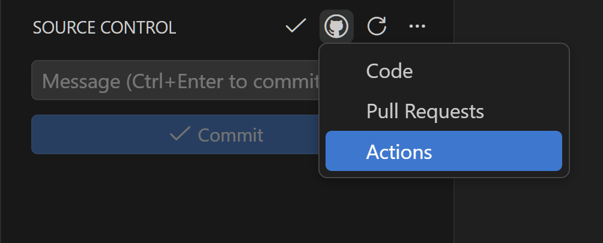

# Open on GitHub

Quickly open your GitHub repository's **Code**, **Pull Requests**, and **Actions** pages directly from the Source Control view in VS Code.

## Features

- Adds a **GitHub** submenu (with the `$(github)` icon) to the Source Control title bar
- One-click access to three key GitHub pages:
  - **Code** — opens the repository home page
  - **Pull Requests** — opens the pull requests tab
  - **Actions** — opens the GitHub Actions tab
- Automatically reads the `origin` remote URL from your repository
- Supports both SSH and HTTPS remote formats

## Usage

1. Open a project that has a GitHub remote configured
2. Navigate to the **Source Control** view
3. Click the **GitHub** icon in the title bar
4. Select **Code**, **Pull Requests**, or **Actions**

Your default browser will open the corresponding GitHub page.

## Requirements

- A Git repository with a GitHub `origin` remote

## Extension Settings

This extension has no configurable settings.

## License

[MIT](LICENSE)
